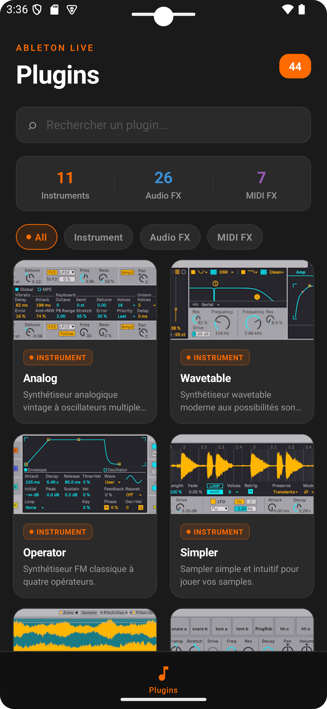
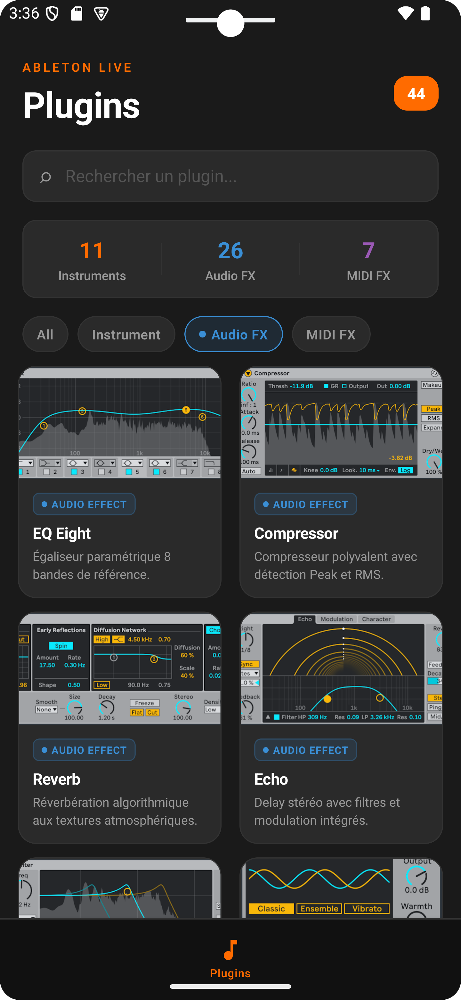

<div align="center">

<br />

# PlugInSight

**Référence mobile des plugins natifs Ableton Live**

Explorez, comprenez et maîtrisez les 40+ instruments, effets audio et effets MIDI intégrés à Ableton Live 12 — avec captures officielles, descriptions détaillées et filtres par catégorie.

<br />


<br />


&nbsp;&nbsp;&nbsp;


<br /><br />

</div>

---

## Fonctionnalités

- **40+ plugins** référencés — Instruments, Audio FX, MIDI FX
- **Captures officielles** Ableton Live 12 pour chaque plugin
- **Recherche** par nom, description ou tag
- **Filtres** par catégorie avec compteurs en temps réel
- **Design** fidèle à l'interface Ableton — dark mode, orange signature
- **Descriptions** détaillées en français pour chaque plugin

## Stack

- [Expo](https://expo.dev) + [Expo Router](https://expo.github.io/router) (file-based routing)
- [React Native](https://reactnative.dev) avec TypeScript
- [expo-image](https://docs.expo.dev/versions/latest/sdk/image/) pour le chargement optimisé des images
- [react-native-safe-area-context](https://github.com/th3rdwave/react-native-safe-area-context)

## Lancer le projet

```bash
npm install
npx expo start
```

Puis ouvrir dans [Expo Go](https://expo.dev/go), un émulateur Android ou un simulateur iOS.

## Structure

```
app/
  (tabs)/
    plugins.tsx     # Écran principal
data/
  plugins.ts        # Données des 40+ plugins
constants/
  theme.ts          # Palette Ableton
```

---

<div align="center">
  <sub>Projet non affilié à Ableton AG. Images © Ableton AG.</sub>
</div>
